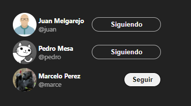

# Twitter Follow Card 👥

## Descripción 📄
Es un proyecto que muestra una tarjeta interactiva de usuarios con botón de seguimiento, inspirado en un componente de Twitter. Construido con React, Vite y CSS.

## Captura de Pantalla 📸

## Características ✨
- Muestra una lista de usuarios con su nombre y estado de seguimiento.
- Permite seguir o dejar de seguir a un usuario con un botón interactivo.

